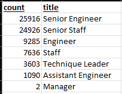
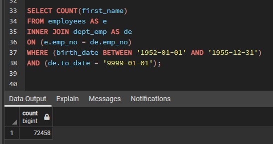

# Pewlett-Hackard-Analysis

## Analysis Overview: 
In preperation for a phenomenon called the "Silver Tsunami", Pewlett-Hackard has asked for an overall look at employees set to retire 
in the upcoming years. Utilizing the average birth year we will begin to breakdown the total amount of potential retirees based on title,
and department. With a closer look at the number of suggested retirees we can sufficently identify individuals who will fit into a mentor role 
to prepare exisiting employees to move up within the company.

## Analysis Results:
#### Retiring emaployees/titles
  1. Pulling a full list of retirement eligible employees gave us a large scale overview, which we further break down.
  2. We then breakdown a second level to unique titles, removing duplicates to show a more accurate view.
  3. Moving to seperate the unique titles into a overall count of retirees based on title, we run a breakdown as shown below. 
  4. Working together these help reflect the overall number of retiring employees based on title, this will lead to a more accurate 
  understanding of how to prepare for the silver tsunami. 

#### Mentorship Eligible Employees
  1. Pulling a list of employees who are still around 10 years from retirement gives us a better look at eligible mentors.
  2. There are 1,549 potential mentors who can provide proper training to prepare those employees who are climbing the ladder. 
  3. The breakdown allows the view of each individual to see how effectively the company can mentor based on title. 
  4. For example, there are 77 Technique leaders eligible for mentorship - the additional breakdown allows for a closer
  examination of how we can branch out based on title, and how this may affect the structure of the program. 

## Aanalysis Summary:
- How many roles will need to be filled as the "silver tsunami" begins to make an impact?
  - 72,458 employees are within the retirement count, retiring over the span of 3 years, with a breakdown of about 24,150 employees
  retiring per year. Assuming those roles will be replaced we will need to see that amount of eligible employees ready for advancement while
  preparing for an influx of new hires.
  

- Are there enough qualified, retirement-ready employees in the departments to mentor the next generation of Pewlett Hackard employees?
  - Based on the number of eligible senior staff that fall within the requirements for the mentorship program we can conclude that the silver
  tsunami heavily outweighs the 1,549 eligible mentors. 
- Two additional queries that might serve to be useful as we approach the best way to handle the silver tsunami:
  - We can run a query on current employees eligible for promotion so we can gain a good understanding of how many people are set to move 
  into those positions once the retiree leaves. This helps to gain a better insight on the true vacancies we will see at the senior level. 
  - We can run a query on manager info to develope a team of qualified employees that can determine the best approach to the mentorship program
  implementation. 
